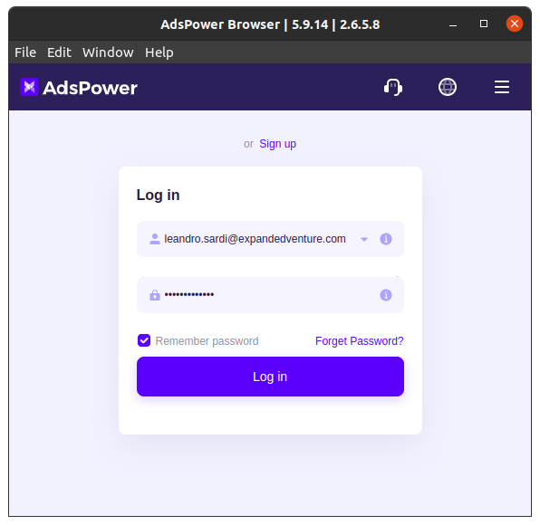

 

# AdsPower Client

Ruby gem for stealthly web-scraping and data-extraction using [AdsPower.com](https://www.adspower.com/) and proxies.

**Outline:**

1. [Installation](#1-installation)
2. [Scraping](#2-scraping)
3. [Advanced](#3-advanced)
4. [Headless](#4-headless)
5. [Logging](#5-logging)

## 1. Installation

First thing first, you need to install the environment.
Then, you have to install the gem.
Finally, you can write code for AdsPower automation.

**Installing Environment:**

```bash
wget https://raw.githubusercontent.com/leandrosardi/environment/main/sh/install.ubuntu.20_04.sh -O - | bash
```

```bash
wget https://raw.githubusercontent.com/leandrosardi/environment/main/sh/install.ubuntu.20_04.adspower.sh -O - | bash
```

**Installing Gem:**

```bash
gem install adspower-client
```

**Writing Code:**

```ruby
client = AdsPowerClient.new(
    key: '************************',
)
```

Remember to open and login to the AdsPower app, as is shown in the picture below.
In the [chatper 4 (Headless)](#4-headless) you will see how to run AdsPower in headless mode.



## 2. Scraping

The `html` method perform the following operations in order to scrape any webpage stealthly:

- create a new profile
- start the browser
- visit the page
- grab the html
- quit the browser from webdriver
- stop the broser from adspower
- delete the profile
- return the html

```ruby
ret = client.html('http://foo.com')
p ret[:profile_id]
# => "jc8y0yt"
p ret[:status]
# => "success"
p ret[:html]
# => ...
```

## 3. Advanced

Internal methods that you should handle to develop advanced bots.

**Checking AdsPower Status**

The `online?` method returns `true` if AdsPower API is available.

```ruby
p client.online?
# => true
```

**Creating Profile**

```ruby
p client.create
# => "jc8y0yt"
```

**Deleting Profile**

```ruby
client.delete('jc8y0yt')
```

**Starting Profile**

```ruby
p client.start('jc8y5g3')
# => {"code"=>0, "msg"=>"success", "data"=>{"ws"=>{"puppeteer"=>"ws://127.0.0.1:43703/devtools/browser/60e1d880-e4dc-4ae0-a2d3-56d123648299", "selenium"=>"127.0.0.1:43703"}, "debug_port"=>"43703", "webdriver"=>"/home/leandro/.config/adspower_global/cwd_global/chrome_116/chromedriver"}}
```

**Stopping Profile**

```ruby
client.stop('jc8y5g3')
```

**Checking Profile**

The `check` method returns `true` if the profile has been started.

```ruby
client.check('jc8y5g3')
# => true
```

**Operating Browser**

```ruby
id = 'jc8y5g3'
url = 'https://google.com'
driver = client.driver(id)
driver.get(url)
```

## 4. Headless

This chapter explains the operations for working with the AdsPower server and browser in headless mode.

**Starting the AdsPower server**

To start the AdsPower server, use the `server_start` method:

```ruby
client = AdsPowerClient.new(key: YOUR_API_KEY)
client.server_start
```

The server will listen the port `50325` by default. 
You can set a custom port:

```ruby
client = AdsPowerClient.new(
    key: YOUR_API_KEY,
    port: 8082,
)
```

**Stopping the AdsPower server**

To stop the AdsPower server, use the `server_stop` method:

```ruby
client.server_stop
```

**Checking if the server is running**

You can verify whether the server is running with the `online?` method:

```ruby
puts client.online? ? "Server is running" : "Server is stopped"
```

**Starting a browser in headless mode**

Pass `true` as the second parameter to the `driver` method to start a browser in headless mode:

```ruby
client = AdsPowerClient.new(key: YOUR_API_KEY)
driver = client.driver(PROFILE_ID, true)
```

## 5. Logging

The `server_start` method seen in [chatper 4 (Headless)](#4-headless) runs a bash line to start the AdsPower server.

Such a bash line redirects both `stdout` and `stderr` to `~/adspower-client.log`.

Check such a logfile if you face any problem to start the AdsPower server.

Feel free to change the location and name for the log:

```ruby
client = AdsPowerClient.new(
    key: '************************',
    server_log: '~/foo.log'
)
```